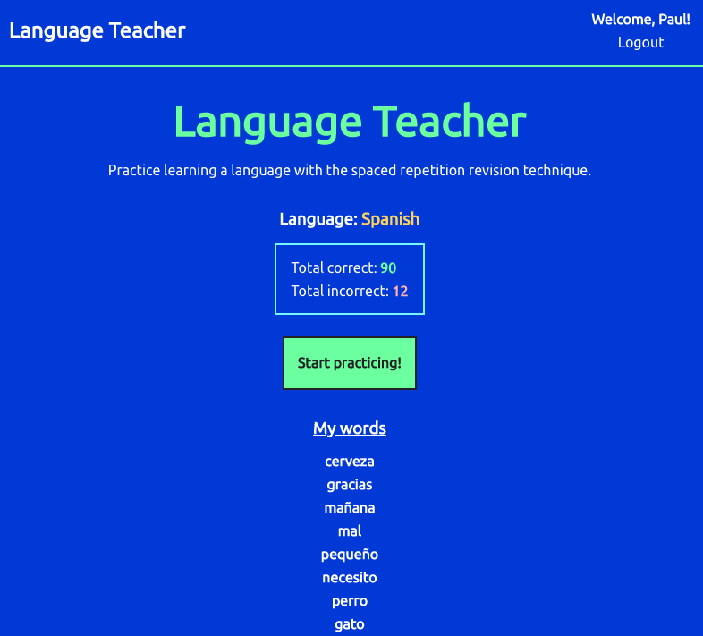

# Language Teacher

Live app:

Client repo: https://github.com/thinkful-ei-leopard/spaced-repetition-paul-matthew

## Summary

<i>Language Teacher</i> is an app for learning new languages using the spaced-repetition revision technique, which is implemented using a linked list to keep track of right and wrong answers.

Users can sign up and login to their personal dashboard, where they can see their current language, current total correct and incorrect scores, along with a list of words to practice and a button to start practicing. Clicking on a word in the dashboard will reveal how many times that word has been answered correctly and incorrectly.

Once a learning session has begun, users will be shown a series of words from the list to translate using text input. Users are then shown a response view, where they are shown whether or not they were correct, what the correct translation is, and how they answered. They will also be shown a button to try the next word. Clicking the 'Try Later' button from the question view will return user to dashboard.

This a demo a version of the app currently in beta. Upcoming features will include:

- ability to learn multiple languages
- ability to add or delete words
- ability to filter/sort words alphabetically, by score, or by date added.

## Technology Used

- React
- Node
- Express
- PostgreSQL
- SCSS

## Endpoints

### /api/language
GET
  * Returns a JSON object with the current language and an array of words associated with that language.

### /api/language/head
GET
   * Returns a JSON object with the next word, total score, and correct and incorrect counts for that word.

### /api/language/guess
POST
* Posts user's response to a word translation question.

### /api/auth
 
 Used for user registration/login authentication

 ## 

## Authors
[Matthew Wagaman](https://github.com/AveraqeDev) and [Paul Baisley](https://github.com/wavinginspace)

